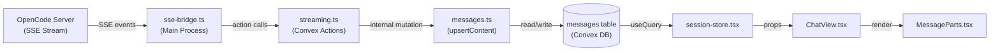

# Deep Analysis: Message Storage in OpenManager

## TL;DR — How Messages Are Stored Right Now

**Each message is its own row** in the `messages` table. It is NOT one giant document per session that keeps growing. Every exchange (user turn, assistant turn) becomes a separate row, identified by `externalId`. During streaming, the same row is **upserted** (patched in-place) many times until `isFinal` becomes `true`.

---

## The Full Data Pipeline



---

## Schema Breakdown

### The `messages` Table ([schema.ts](file:///c:/Users/rajku/OneDrive/Documents/ClePro/openmanager/convex/schema.ts#L26-L38))

| Field | Type | Purpose |
|---|---|---|
| `sessionId` | `Id<'sessions'>` | FK to parent session |
| `externalId` | `string` | The OpenCode message ID — used as dedup/upsert key |
| `role` | `string` | `"user"`, `"assistant"`, or `"permission"` |
| `content` | `string` | Concatenated text from all `text` parts |
| `metadata` | `any?` | Untyped blob — in practice `{ parts: PartData[] }` |
| `createdAt` | `number` | Epoch ms — set on first insert |
| `sequenceNum` | `number` | Ordering key — monotonically increasing per session |
| `isFinal` | `boolean?` | `false` while streaming, `true` when complete |

**Indexes:**
- `by_session` — list all messages for a session
- `by_externalId` — fast upsert lookup (indexed point-query)
- `by_session_seq` — ordered retrieval for rendering

---

## How Each Message Gets Into the Database

### Step 1: SSE Events Arrive — [sse-bridge.ts](file:///c:/Users/rajku/OneDrive/Documents/ClePro/openmanager/src/main/sse-bridge.ts)

The bridge connects to `/global/event` on the OpenCode server and processes three kinds of message events:

| Event | What happens |
|---|---|
| `message.updated` | **Full message snapshot** — parses all parts, de-duplicates by ID, concatenates text, and calls `flushMessageBatch` immediately |
| `message.part.updated` | Buffers the part in-memory (`Map<partId, PartData>`) |
| `message.part.delta` | Appends delta text to existing buffered part |

A **150ms interval timer** (`BATCH_FLUSH_MS`) flushes all in-memory buffers to Convex.

> [!IMPORTANT]
> There are **two flush paths**: (1) immediate flush on `message.updated`, and (2) periodic 150ms timer flush for delta/part updates. Both call the same `flushMessageBatch` action.

### Step 2: Convex Action → Mutation — [streaming.ts](file:///c:/Users/rajku/OneDrive/Documents/ClePro/openmanager/convex/streaming.ts) → [messages.ts](file:///c:/Users/rajku/OneDrive/Documents/ClePro/openmanager/convex/messages.ts)

`flushMessageBatch` is a Convex **action** that wraps `upsertContent`, an **internal mutation**:

```
flushMessageBatch (action)
  └─► upsertContent (internalMutation)
        ├─ Query by_externalId index → find existing row
        ├─ IF exists: patch content, isFinal, metadata
        └─ IF not: lookup session by_externalId, then insert new row
```

### Step 3: Reading Messages — [session-store.tsx](file:///c:/Users/rajku/OneDrive/Documents/ClePro/openmanager/src/renderer/src/stores/session-store.tsx#L83-L86)

```typescript
const rawMessages = useQuery(
  api.messages.listBySession,
  activeSessionId ? { sessionExternalId: activeSessionId } : 'skip',
)
```

This is a **reactive Convex query** — it re-runs automatically whenever any message in that session is inserted or patched. The result is mapped into `UIMessage[]` objects that extract `metadata.parts` into a typed array.

### Step 4: Rendering — [ChatView.tsx](file:///c:/Users/rajku/OneDrive/Documents/ClePro/openmanager/src/renderer/src/components/ChatView.tsx) → [MessageParts.tsx](file:///c:/Users/rajku/OneDrive/Documents/ClePro/openmanager/src/renderer/src/components/parts/MessageParts.tsx)

Each message row renders as either a `UserMessage` (right-aligned bubble) or `AssistantMessage`. If `parts` exist, `MessageParts` renders each part by type: `text` → Markdown, `tool` → collapsible card, `reasoning` → thinking block, `step-finish` → metadata line.

---

## What About User Messages?

User messages take a **different path** — they go through the **job queue**, not directly into the messages table:


The user message only appears in the `messages` table **after** the OpenCode server echoes it back as a `message.updated` SSE event with `role: "user"`. This means there's a brief delay between typing and seeing your own message.

---

## Is This the Right Pattern? Analysis

### What the Current Pattern Does Well

| Aspect | Assessment |
|---|---|
| **Granularity** | ✅ One row per message is the correct granularity. It avoids the pitfall of one giant growing document that would cause massive read/write amplification on every keystroke. |
| **Upsert pattern** | ✅ Using `externalId` as a natural key for upsert means duplicate events are idempotent — safe against SSE reconnects |
| **Sequence ordering** | ✅ `by_session_seq` index gives correct display ordering |
| **Streaming visibility** | ✅ `isFinal` flag lets the UI show streaming state |

### Current Concerns and Inefficiencies

#### 1. Excessive Write Amplification During Streaming

> [!WARNING]
> Every 150ms, **every buffered message** gets its entire `content` + `parts` array rewritten via `db.patch`. A single assistant response that streams for 30 seconds generates ~200 patch operations to the **same row**, each replacing the full content string and the entire parts array.

**Why this matters:** Each Convex `db.patch` counts as a full mutation towards your billing. The `content` field grows from empty to potentially thousands of characters, and each patch writes the full new value. The `metadata.parts` array also gets rewritten in full each time.

#### 2. Action → Mutation Double-Hop

`flushMessageBatch` is an **action** that calls an **internal mutation**. Actions cost more than mutations in Convex billing and have higher latency. Since `flushMessageBatch` does nothing except call the mutation (no HTTP calls, no external I/O), this wrapper is unnecessary overhead.

**Impact:** Every flush (every 150ms per message ×  number of active messages) triggers both an action invocation AND a mutation invocation.

#### 3. `content` Is Redundant with `parts`

The `content` field is built by concatenating all `text`-type parts: `textParts.map(p => p.text).join('')`. But the same text is also stored inside `metadata.parts[].text`. This means every text character is stored **twice** in the same row.

#### 4. Untyped `metadata: v.any()`

The `metadata` field uses `v.any()`, which means Convex can't validate or optimize it. The parts array structure is implicitly `{ parts: PartData[] }` but there's no schema enforcement. This makes data exploration and debugging harder.

#### 5. `sequenceNum` Is Not Stable

The `sequenceNum` comes from an in-memory counter in `sse-bridge.ts`:
```typescript
private nextSeq(sessionId: string): number {
    const n = (this.seqCounters.get(sessionId) ?? -1) + 1
    this.seqCounters.set(sessionId, n)
    return n
}
```
This counter resets when the app restarts. If the bridge reconnects, messages will get new `sequenceNum` values that don't match the original ordering. Since `message.updated` events call `nextSeq` on **every** event (not just first sight), the `sequenceNum` actually keeps incrementing during streaming — a single message doesn't have a stable sequence number.

#### 6. No Cleanup of Completed Jobs

`pending_jobs` rows are updated to `status: 'done'` but never deleted, accumulating over time.

---

## Recommendations for Optimization

### Tier 1: Quick Wins (No Schema Change)

1. **Remove the action wrapper** — Change `flushMessageBatch` from an action to a direct `internalMutation`. This halves the function invocation cost per flush.

2. **Debounce more aggressively** — Increase `BATCH_FLUSH_MS` from 150ms to 300-500ms for non-final flushes. The UI already shows streaming state, and human perception won't notice the difference.

3. **Skip no-op patches** — Before patching, compare `content` length. If it hasn't changed since the last flush, skip the write.

### Tier 2: Schema Improvements

4. **Drop the `content` field** — Derive it from `parts` at query time or in the renderer. This eliminates double-storage.

5. **Type the metadata** — Replace `v.any()` with a proper union validator:
   ```typescript
   metadata: v.optional(v.object({
     parts: v.array(v.object({
       type: v.string(),
       id: v.string(),
       // ...typed fields per part type
     }))
   }))
   ```

6. **Fix sequenceNum stability** — Assign `sequenceNum` only on first insert, not on every update. Use the creation order rather than an in-memory counter.

### Tier 3: Architecture-Level (If Bandwidth is a Problem)

7. **Separate streaming buffer from final storage** — Use a lightweight `streaming_buffer` table for in-progress messages (high write frequency, auto-delete on completion). Only write to `messages` on `isFinal: true`. This would dramatically reduce write amplification.

8. **Store parts in a subtable** — Instead of one blob, each part could be its own row in a `message_parts` table linked by `messageId`. This allows patching individual parts without rewriting the entire array. However, this increases read complexity.

---

## Summary Table

| Question | Answer |
|---|---|
| Is each message a separate row? | **Yes** — one row per message (user turn or assistant turn) |
| Does a session have one growing document? | **No** — each message is independent with a `sessionId` FK |
| How many writes per assistant response? | **~200 patches** for a 30s stream (every 150ms) |
| Is the current pattern reasonable? | **Structurally yes**, but the streaming write frequency is very high |
| Biggest optimization opportunity? | Remove the action wrapper and debounce more aggressively to cut writes by 50-70% |
