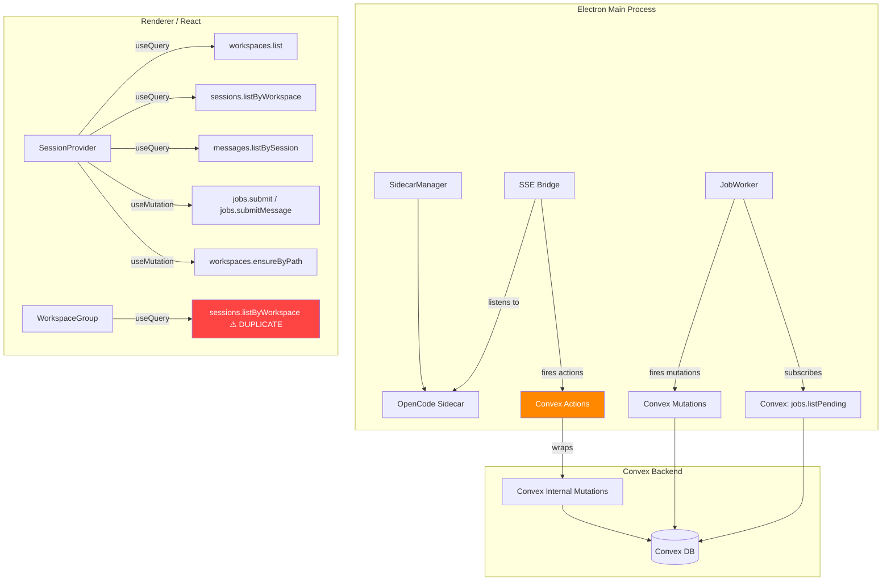

# Convex Usage Analysis — OpenManager

> Deep analysis of Convex resource consumption: **3.28 GB database reads/day**, **272K mutations**, **268K actions**, **103K queries** — all for ~130 messages, ~10 sessions, and 3 workspaces.

---

## Architecture Overview




The app is an Electron desktop client that manages OpenCode sidecar processes. SSE events from the sidecar are relayed to Convex, and the React renderer subscribes to Convex queries to display workspace/session/message data.

---

## Database Schema (4 Tables)


| Table          | Documents | Fields Stored                                                                                                           | Indexes                                         |
| -------------- | --------- | ----------------------------------------------------------------------------------------------------------------------- | ----------------------------------------------- |
| `workspaces`   | ~3        | name, path, machineId, timestamps                                                                                       | `by_path`, `by_machineId`                       |
| `sessions`     | ~10       | workspaceId, externalId, title, status, timestamps                                                                      | `by_workspace`, `by_externalId`                 |
| `messages`     | ~130      | sessionId, externalId, role, **content** (full text), **metadata** (full parts array), timestamps, sequenceNum, isFinal | `by_session`, `by_externalId`, `by_session_seq` |
| `pending_jobs` | ~59       | workspaceId, sessionId, type, payload, status, attempts, claimedBy, timestamps                                          | `by_status`, `by_workspace`                     |


> [!CAUTION]
> The `messages` table stores **full message content + full parts metadata** as a single document. Every reactive query re-read of a session's messages transfers the **entire content of every message document**, including potentially large tool call results, code blocks, and nested part structures.

---

## Critical Finding #1: SSE Bridge Double-Firing

**Root cause of ~50% of your action count and a major contributor to mutations.**

### The problem

The [SSE bridge](file:///c:/Users/rajku/OneDrive/Documents/ClePro/openmanager/src/main/sse-bridge.ts) has **two independent paths** that both write the same data to Convex:

#### Path A — Per-event direct action calls (line 204)

Every `message.updated` SSE event **immediately** fires `api.streaming.flushMessageBatch`:

```typescript
// sse-bridge.ts:204 — fires on EVERY message.updated event
this.convex.action(api.streaming.flushMessageBatch, { ... })
```

#### Path B — 150ms interval batch flush (line 35, 328-332)

A `setInterval` runs every **150ms** and flushes ALL buffered messages:

```typescript
// sse-bridge.ts:35
this.flushTimer = setInterval(() => this.flushAll(), BATCH_FLUSH_MS)

// sse-bridge.ts:328-332
private async flushAll(): Promise<void> {
  for (const [msgId] of this.buffers) {
    await this.flushMessage(msgId, false)  // fires flushMessageBatch action
  }
}
```

#### The double-counting math

For a **single streaming message** that takes 10 seconds to complete:

- `message.updated` events fire rapidly (every few hundred ms) → ~**20-50 action calls** via Path A
- `flushAll()` fires every 150ms → ~**66 action calls** via Path B

**Combined: ~80-116 Convex actions per single streaming message.**

Each `flushMessageBatch` action (in [streaming.ts](file:///c:/Users/rajku/OneDrive/Documents/ClePro/openmanager/convex/streaming.ts)) calls an `internalMutation`, so you also get **80-116 mutations per message**.

> [!WARNING]  
> `message.part.delta` events accumulate in the buffer (Path B only), but `message.updated` events bypass the buffer entirely and fire directly (Path A). This means the batching system is effectively **defeated** for the most common event type.

---

## Critical Finding #2: Action-Wrapping-Mutation Anti-Pattern

**Root cause of your 268K action count being nearly identical to your 272K mutation count.**

Every function in [streaming.ts](file:///c:/Users/rajku/OneDrive/Documents/ClePro/openmanager/convex/streaming.ts) is an `action` that does nothing except call a single `internalMutation`:

```typescript
// streaming.ts — ALL 4 functions follow this pattern:
export const flushMessageBatch = action({
  handler: async (ctx, args) => {
    await ctx.runMutation(internal.messages.upsertContent, { ...args })
  },
})

export const updateSessionStatus = action({
  handler: async (ctx, args) => {
    await ctx.runMutation(internal.sessions.upsertStatus, args)
  },
})
```

**Impact**: Every write operation costs **2 function calls** (1 action + 1 mutation) instead of 1. This alone could be halving your action count.

The reason these exist as actions instead of mutations is that the main process calls `this.convex.action(...)` from the SSE bridge. However, `ConvexClient` can call mutations directly — there is no technical reason for the action wrapper.

---

## Critical Finding #3: Duplicate Query Subscriptions

**Contributor to inflated query count and read bandwidth.**

### SessionProvider (session-store.tsx:78-81)

```typescript
const rawSessions = useQuery(
  api.sessions.listByWorkspace,
  activeWorkspacePath ? { workspacePath: activeWorkspacePath } : 'skip',
)
```

### WorkspaceGroup (WorkspaceSidebar.tsx:107-109)

```typescript
const rawSessions = useQuery(api.sessions.listByWorkspace, {
  workspacePath: workspace.path,
})
```

**Each `WorkspaceGroup` component** (one per workspace) creates its **own** subscription to `sessions.listByWorkspace`. Meanwhile, the `SessionProvider` also subscribes for the active workspace.

With 3 workspaces:

- **SessionProvider**: 1 subscription (active workspace only)
- **WorkspaceGroup × 3**: 3 subscriptions (one per workspace, always active)
- **Net**: 4 total subscriptions, with the active workspace being subscribed **twice**

Each subscription re-executes its query handler whenever the `sessions` table changes, reading the workspace document + all session documents for that workspace.

> [!IMPORTANT]
> The `WorkspaceGroup` subscriptions are **never skipped** — they're always active even when collapsed. This means every session status update causes re-reads across ALL workspace subscriptions.

---

## Critical Finding #4: Full-Document Reads for Messages

**The single biggest contributor to your 3.28 GB read bandwidth.**

### The query ([messages.ts:61-74](file:///c:/Users/rajku/OneDrive/Documents/ClePro/openmanager/convex/messages.ts#L61-L74))

```typescript
export const listBySession = query({
  handler: async (ctx, args) => {
    const session = await ctx.db
      .query('sessions')
      .withIndex('by_externalId', ...)
      .first()
    if (!session) return []
    return await ctx.db
      .query('messages')
      .withIndex('by_session_seq', ...)
      .collect()  // ← returns ALL fields of ALL messages
  },
})
```

### Why this is devastating

1. **Every message document** includes the full `content` field (could be thousands of characters of code/text) AND the full `metadata` field (entire parts array with tool calls, text, etc.)
2. `.collect()` returns **all messages** for the session — no pagination
3. This is a **reactive subscription** — it **re-runs every time any message in the session changes**
4. During streaming, `upsertContent` updates a message's content field every 150ms (from the batch flush) AND on every `message.updated` event

#### Bandwidth math for a single streaming response

Assume a session has 20 existing messages averaging 2KB each, and a new assistant message is streaming:

- Each `upsertContent` mutation triggers a reactive re-read of `listBySession`
- Each re-read transfers: 20 messages × 2KB + 1 streaming message = ~42KB
- With ~80-116 updates per stream (Finding #1): **42KB × 100 = ~4.2 MB per streaming message**
- Across a day of moderate usage (50 messages): **~210 MB/day just from message streaming reactivity**

Now factor in that real messages can be much larger (10-50KB with code blocks), and you approach GB territory quickly.

---

## Critical Finding #5: JobWorker Global Subscription

**Contributor to inflated query count and unnecessary re-reads.**

### The subscription ([job-worker.ts:27](file:///c:/Users/rajku/OneDrive/Documents/ClePro/openmanager/src/main/job-worker.ts#L27))

```typescript
const unsub = this.convex.onUpdate(api.jobs.listPending, {}, (jobs) => { ... })
```

### The query ([jobs.ts:94-102](file:///c:/Users/rajku/OneDrive/Documents/ClePro/openmanager/convex/jobs.ts#L94-L102))

```typescript
export const listPending = query({
  args: {},
  handler: async (ctx) => {
    return await ctx.db
      .query('pending_jobs')
      .withIndex('by_status', (q) => q.eq('status', 'pending'))
      .collect()
  },
})
```

**Problems**:

1. This subscription is **always active** for the entire app lifetime — it re-fires whenever the `pending_jobs` table changes
2. Every job status change (pending → running → done/failed) triggers a reactive re-read
3. The query reads **all pending jobs globally** — no workspace scoping
4. Jobs accumulate in the table (they're never cleaned up after completion) — 59 documents currently
5. Each job's `complete` mutation (changing status) triggers a re-evaluation of this subscription, which now reads all remaining pending jobs

---

## Critical Finding #6: Session Status Chattiness

**Contributor to action and mutation inflation.**

The SSE bridge handles multiple event types that all call `updateSessionStatus`:

```typescript
// sse-bridge.ts — THREE different event types trigger the same action:
case 'session.updated':
case 'session.created':    →  api.streaming.updateSessionStatus
case 'session.status':     →  api.streaming.updateSessionStatus
case 'session.error':      →  api.streaming.updateSessionStatus (status='error')
```

During an active coding session, OpenCode fires `session.status` events frequently (idle → running → waiting → running → idle). Each one:

1. Fires 1 action (`streaming.updateSessionStatus`)
2. Which fires 1 internal mutation (`sessions.upsertStatus`)
3. Which reads from `sessions` table (index lookup) and then patches
4. The patch triggers reactive re-reads of ALL `sessions.listByWorkspace` subscriptions (Finding #3 — there are 4 of them)

---

## Complete Function Call Inventory

### Convex Queries (103K)


| Query                      | Location Called                                                                                                                                | Subscription Type                       | Trigger Frequency                                     |
| -------------------------- | ---------------------------------------------------------------------------------------------------------------------------------------------- | --------------------------------------- | ----------------------------------------------------- |
| `workspaces.list`          | [session-store.tsx:76](file:///c:/Users/rajku/OneDrive/Documents/ClePro/openmanager/src/renderer/src/stores/session-store.tsx#L76)             | `useQuery` (reactive)                   | Re-fires on ANY workspace table write                 |
| `sessions.listByWorkspace` | [session-store.tsx:78](file:///c:/Users/rajku/OneDrive/Documents/ClePro/openmanager/src/renderer/src/stores/session-store.tsx#L78)             | `useQuery` (reactive)                   | Re-fires on ANY session table write                   |
| `sessions.listByWorkspace` | [WorkspaceSidebar.tsx:107](file:///c:/Users/rajku/OneDrive/Documents/ClePro/openmanager/src/renderer/src/components/WorkspaceSidebar.tsx#L107) | `useQuery` (reactive) **×N workspaces** | **DUPLICATE** — same re-fire                          |
| `sessions.getByExternalId` | Not used in frontend                                                                                                                           | —                                       | —                                                     |
| `messages.listBySession`   | [session-store.tsx:83](file:///c:/Users/rajku/OneDrive/Documents/ClePro/openmanager/src/renderer/src/stores/session-store.tsx#L83)             | `useQuery` (reactive)                   | Re-fires on **every message upsert** during streaming |
| `workspaces.getById`       | Not actively used                                                                                                                              | —                                       | —                                                     |
| `workspaces.getByPath`     | Not actively used                                                                                                                              | —                                       | —                                                     |
| `jobs.listPending`         | [job-worker.ts:27](file:///c:/Users/rajku/OneDrive/Documents/ClePro/openmanager/src/main/job-worker.ts#L27)                                    | `onUpdate` (reactive)                   | Re-fires on **every pending_jobs table write**        |


### Convex Mutations (272K)


| Mutation                      | How It's Called                            | What It Does Per Call                                                                |
| ----------------------------- | ------------------------------------------ | ------------------------------------------------------------------------------------ |
| `messages.upsertContent`      | Via `streaming.flushMessageBatch` action   | Reads `messages` by externalId, reads `sessions` by externalId, then insert or patch |
| `sessions.upsertStatus`       | Via `streaming.updateSessionStatus` action | Reads `sessions` by externalId, reads `workspaces` by path, then insert or patch     |
| `sessions.remove`             | Via `streaming.deleteSession` action       | Reads `sessions` by externalId, then delete                                          |
| `messages.removeByExternalId` | Via `streaming.deleteMessage` action       | Reads `messages` by externalId, then delete                                          |
| `jobs.submit`                 | Direct from renderer via `useMutation`     | Reads `workspaces` by path, then insert                                              |
| `jobs.submitMessage`          | Direct from renderer via `useMutation`     | Reads `workspaces` by path, then insert                                              |
| `jobs.claim`                  | Direct from main process                   | Reads job by ID, then patch                                                          |
| `jobs.complete`               | Direct from main process                   | Patch only                                                                           |
| `workspaces.ensureByPath`     | Direct from renderer via `useMutation`     | Reads `workspaces` by path, then insert or return                                    |
| `workspaces.remove`           | Direct from renderer via `useMutation`     | Delete                                                                               |
| `workspaces.update`           | Not actively used                          | —                                                                                    |
| `workspaces.create`           | Not actively used                          | —                                                                                    |


### Convex Actions (268K)


| Action                          | Called From                                      | What It Does                                 |
| ------------------------------- | ------------------------------------------------ | -------------------------------------------- |
| `streaming.flushMessageBatch`   | SSE bridge (per-event + 150ms interval)          | Wraps `messages.upsertContent` mutation      |
| `streaming.updateSessionStatus` | SSE bridge (session events)                      | Wraps `sessions.upsertStatus` mutation       |
| `streaming.deleteSession`       | SSE bridge (session.deleted)                     | Wraps `sessions.remove` mutation             |
| `streaming.deleteMessage`       | SSE bridge (message.removed, permission.replied) | Wraps `messages.removeByExternalId` mutation |


> [!IMPORTANT]
> **100% of actions are thin wrappers.** Every action could be replaced with a direct mutation call, immediately halving the function call count for write operations.

---

## Read Bandwidth Breakdown (Estimated)


| Source                                                      | Mechanism                                                                                  | Estimated Daily Impact |
| ----------------------------------------------------------- | ------------------------------------------------------------------------------------------ | ---------------------- |
| `messages.listBySession` reactive re-reads during streaming | Every message upsert triggers full session re-read (all messages, full content + metadata) | **~1.5–2.5 GB**        |
| `messages.upsertContent` reads inside mutation              | Each upsert reads messages table (by externalId) + sessions table (by externalId)          | **~400–600 MB**        |
| `sessions.listByWorkspace` × 4 duplicate subscriptions      | Every session status change re-reads workspace + all sessions, 4 times                     | **~100–200 MB**        |
| `jobs.listPending` continuous subscription                  | Every job lifecycle event re-reads all pending jobs                                        | **~50–100 MB**         |
| `sessions.upsertStatus` reads inside mutation               | Each status update reads sessions (by externalId) + workspaces (by path)                   | **~50–100 MB**         |
| `workspaces.list` reactive subscription                     | Very low — only 3 docs, rare changes                                                       | **<1 MB**              |


**Total estimated: ~2.1–3.5 GB** — aligns with your observed 3.28 GB.

---

## Recommended Optimizations (Ranked by Impact)

### 🔴 Priority 1: Fix SSE Bridge Double-Firing

- Remove the direct `flushMessageBatch` call from `message.updated` handler
- Let the **buffer + 150ms batch flush** be the sole write path
- **Expected savings**: ~~50% reduction in actions and mutations (~~135K each)

### 🔴 Priority 2: Replace Actions with Direct Mutations

- Change `this.convex.action(api.streaming.*)` → `this.convex.mutation(api.messages.upsertContent)` (expose as public mutation or use direct calls)
- Eliminate `streaming.ts` entirely
- **Expected savings**: ~268K actions → 0 (actions become mutations)

### 🔴 Priority 3: Return Minimal Fields from `listBySession`

- Create a "light" query that returns only `{ externalId, role, isFinal, sequenceNum }` for the sidebar/list
- Return full content only when viewing a specific message or via pagination
- Alternatively, paginate with `.paginate()` instead of `.collect()`
- **Expected savings**: ~~60-80% read bandwidth reduction (~~2 GB)

### 🟠 Priority 4: Eliminate Duplicate Session Subscriptions

- Remove `useQuery(sessions.listByWorkspace)` from `WorkspaceGroup` — use the one from `SessionProvider` passed down via context
- **Expected savings**: ~2-3× fewer session query re-executions

### 🟠 Priority 5: Increase Batch Flush Interval

- Change `BATCH_FLUSH_MS` from 150ms to 500ms–1000ms
- Use `isFinal` flag to do an immediate flush only when message completes
- **Expected savings**: ~3-6× fewer mutations per streaming message

### 🟡 Priority 6: Scope and Clean Up Jobs

- Add workspace filtering to `listPending` query
- Clean up completed/failed jobs (delete after processing)
- **Expected savings**: Fewer reactive re-reads, smaller result sets

### 🟡 Priority 7: Debounce Session Status Updates

- Coalesce rapid `session.status` events (e.g., idle→running→waiting happens in milliseconds)
- Only write the latest status after a short debounce window (e.g., 500ms)
- **Expected savings**: ~50-70% fewer session status mutations

### 🟢 Priority 8: Consider Persistent Text Streaming Pattern

- Convex's [Persistent Text Streaming](https://www.convex.dev/components/persistent-text-streaming) component uses delta-based storage with configurable `throttleMs`
- Instead of upserting the entire message content on each flush, store only new deltas
- Reconstruct full content on read (or on finalization)
- **Expected savings**: Dramatically smaller per-mutation write size and fewer reactive query invalidations

---

## Clarifications (from discussion)

### The two queries — what they actually do


| Query                      | File                 | What it fetches                                                                     | When it re-fires                                                                             |
| -------------------------- | -------------------- | ----------------------------------------------------------------------------------- | -------------------------------------------------------------------------------------------- |
| `sessions.listByWorkspace` | `convex/sessions.ts` | All sessions for a given workspace path                                             | Every time **any session** in that workspace changes (status, title, etc.)                   |
| `messages.listBySession`   | `convex/messages.ts` | **All messages** for a given session — full content + full metadata parts, no limit | Every time **any message** in that session changes — i.e. every 150ms flush during streaming |


`listBySession` is the bandwidth killer. `listByWorkspace` amplifies it through duplicate subscriptions.

### Why bandwidth grows even when you don't use the app

The subscriptions are always open via WebSocket. Any background mutation — a sidecar heartbeat changing session status, a job being processed, anything touching those tables — triggers reactive re-reads even with the app idle. You don't have to send a message for reads to accumulate.

### Why 2 GB is possible with only 130 messages

If 130 messages average 5KB each, that's 650KB per re-read of `listBySession`. With double-firing (150ms interval + per-event), that's ~300 re-reads for a 60-second stream. **300 × 650KB = ~195 MB for a single exchange.** Do 10 sessions worth of work in a day and you're at 2+ GB. Messages with code blocks can be 20-50KB each, pushing that much higher.

### Switching workspaces doesn't stop subscriptions

`SessionProvider` correctly skips the inactive workspace (`'skip'` when no activeWorkspacePath). But each `WorkspaceGroup` in the sidebar has its own always-on subscription — switching to a different workspace doesn't unsubscribe the others. All N workspace group subscriptions remain active until the app is closed.

---

## Consolidated Bug List (all identified issues)

**Subscriptions — query side**

1. `sessions.listByWorkspace` subscribed both in `SessionProvider` AND in each `WorkspaceGroup` — N+1 duplicate subscriptions, all always running
2. `messages.listBySession` re-fires every ~150ms during streaming because every `upsertContent` mutation invalidates it

**Query data shape — what's returned**
3. `listBySession` uses `.collect()` with no pagination — returns every message in the session with full `content` + full `metadata` parts array on every single re-fire
4. `listByWorkspace` returns more session fields than the sidebar needs

**Mutation side — write frequency**
5. SSE bridge double-fires: `message.updated` events trigger `flushMessageBatch` directly (Path A) AND the 150ms interval also flushes the same buffer (Path B) — same data written twice
6. 150ms flush interval is too aggressive — ~6-7 Convex writes per second during an active stream
7. `streaming.ts` — all 4 functions are actions that just call a single mutation, doubling function call cost for zero benefit

**Architecture**
8. `jobs.listPending` is global with no workspace filter — every job state change re-reads all pending jobs for the entire app lifetime
9. Completed/failed jobs are never deleted — they accumulate in the `pending_jobs` table, making every re-read larger over time

---

## Summary Table


| Issue                               | Type                | Impact (Est. Daily)            | Fix Complexity                  |
| ----------------------------------- | ------------------- | ------------------------------ | ------------------------------- |
| SSE bridge double-firing            | Actions + Mutations | ~135K actions, ~135K mutations | Low — code removal              |
| Action wrapper anti-pattern         | Actions             | ~268K wasted actions           | Low — API change                |
| Full-doc message reads              | Read bandwidth      | ~2 GB                          | Medium — new query + pagination |
| Duplicate session subscriptions     | Queries + reads     | ~100-200 MB                    | Low — remove useQuery           |
| 150ms batch interval too aggressive | Mutations           | ~5× over-writing               | Low — config change             |
| Global unscoped job polling         | Queries + reads     | ~50-100 MB                     | Low — add arg filter            |
| Session status chattiness           | Actions + Mutations | ~50K+ combined                 | Medium — debounce logic         |


