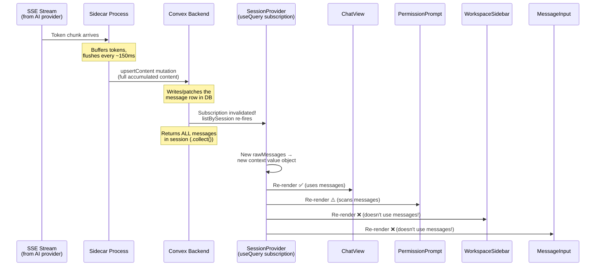

# How `useSessionStore` Connects Everything — Full Reactive Chain

## What is `useSessionStore`?

It's a **React Context provider + hook** pattern. The whole app is wrapped in one single `SessionProvider`, and every component that needs *any* session-related data calls `useSessionStore()` to get it.

Think of it as a **single shared bucket** that holds:
- The list of workspaces
- The list of sessions for the active workspace
- **All messages for the active session** ← the expensive one
- Functions to create sessions, send messages, abort, etc.

Every component that dips into this bucket **will re-render whenever anything in the bucket changes**, even if that component only cares about one small piece.

---

## The Component Tree

```
App  (root)
└── SessionProvider  ← creates the "bucket" (React Context)
    └── AppShell
        ├── WorkspaceSidebar   ← calls useSessionStore()
        ├── ChatView           ← calls useSessionStore()
        ├── MessageInput       ← calls useSessionStore()
        └── PermissionPrompt   ← calls useSessionStore()
```
[App.tsx](file:///c:/Users/rajku/OneDrive/Documents/ClePro/openmanager/src/renderer/src/App.tsx) · [session-store.tsx](file:///c:/Users/rajku/OneDrive/Documents/ClePro/openmanager/src/renderer/src/stores/session-store.tsx)

---

## What each component actually destructures

| Component | What it reads from the store | Does it use `messages`? |
|---|---|---|
| **ChatView** | `activeSessionId`, `messages`, `sessions`, `abortSession` | ✅ Yes — renders the chat timeline |
| **PermissionPrompt** | `messages`, `activeSessionId`, `resolvePermission` | ✅ Yes — scans for permission requests |
| **WorkspaceSidebar** | `workspaces`, `activeWorkspacePath`, `activeSessionId`, `addWorkspace`, `removeWorkspace` | ❌ No |
| **MessageInput** | `activeSessionId`, `activeWorkspacePath`, `workspaces`, `sendMessage` | ❌ No |

> [!IMPORTANT]
> **WorkspaceSidebar and MessageInput never touch `messages`**, yet they still re-render every time messages change because they're subscribed to the same context object.

---

## The Three Convex Reactive Subscriptions

Inside `SessionProvider`, there are exactly **three `useQuery` calls** — three live Convex subscriptions:

```tsx
// 1. Always active — fetches all workspaces
const rawWorkspaces = useQuery(api.workspaces.list)

// 2. Active when a workspace is selected
const rawSessions = useQuery(
  api.sessions.listByWorkspace,
  activeWorkspacePath ? { workspacePath: activeWorkspacePath } : 'skip',
)

// 3. Active when a session is selected  ← THE PROBLEM
const rawMessages = useQuery(
  api.messages.listBySession,
  activeSessionId ? { sessionExternalId: activeSessionId } : 'skip',
)
```

When **any** of these three return new data, React creates a new context `value` object → every consumer re-renders.

---

## Step-by-Step: What happens when a streaming message arrives

Here's the exact chain of events, numbered sequentially:



### Walking through it:

**① Token arrives via SSE** → The AI provider streams tokens to your sidecar process.

**② Sidecar buffers and flushes every ~150ms** → It accumulates tokens and calls `upsertContent` on the Convex backend with the **full accumulated content so far**.

**③ `upsertContent` writes to the `messages` table** → It either patches an existing message row (updates `content`, `isFinal`, `metadata`) or inserts a new one.

[messages.ts:upsertContent](file:///c:/Users/rajku/OneDrive/Documents/ClePro/openmanager/convex/messages.ts#L4-L48)

**④ Convex detects the table was touched** → Because `listBySession` reads from the `messages` table, and a row in that table just changed, Convex **invalidates** the subscription and re-runs the query.

**⑤ `listBySession` re-runs and returns EVERYTHING** → It does `.collect()`, which means it fetches **every single message** in the session — with full `content` and full `metadata` — not just the one that changed.

**⑥ `useQuery` in SessionProvider receives the new result** → React sees that `rawMessages` changed → the `messages` array is re-derived → a new context `value` object is created.

**⑦ ALL four components re-render** → Because React Context works by **reference equality** on the value object. A new object = every consumer re-renders. Period. It doesn't matter that `WorkspaceSidebar` only reads `workspaces`.

---

## Your intuition is exactly right

> "In the UI it looks like it's rendering chunk by chunk, but technically behind the scenes every time a chunk comes in it's fetching everything."

**Yes, exactly.** Here's a concrete example:

````carousel
### After 1st flush (~150ms)
```
upsertContent → message row = "Hello"
listBySession re-fires → returns ["Hello"]
All 4 components re-render
```
<!-- slide -->
### After 2nd flush (~300ms)
```
upsertContent → message row = "Hello, how are"
listBySession re-fires → returns ALL messages including "Hello, how are"
All 4 components re-render
```
<!-- slide -->
### After 3rd flush (~450ms)
```
upsertContent → message row = "Hello, how are you doing today?"
listBySession re-fires → returns ALL messages (still the full set)
All 4 components re-render
```
<!-- slide -->
### After 100th flush (~15 seconds in)
```
upsertContent → patches message with 100 flushes worth of content
listBySession re-fires → returns ALL 130+ messages in session
   (each with full content + full metadata/parts)
All 4 components re-render — for the 100th time
```
````

The user sees smooth token-by-token rendering. But under the hood, each "token" triggers a full re-fetch of the entire session's messages and a full re-render of the entire app.

---

## The two distinct problems

### Problem 1: Convex bandwidth (server-side)

`listBySession` uses `.collect()` with no field projection. Every re-fire sends **all messages × all fields** over the wire.

> If 130 messages average 5KB → **650KB per re-fire**  
> 60-second stream @ 150ms flushes → **~400 re-fires**  
> **400 × 650KB ≈ 260 MB for a single exchange**

### Problem 2: Unnecessary React re-renders (client-side)

Because all state lives in one Context, **every property change triggers every consumer to re-render**, even when a component doesn't use the changed property.

```
messages change
  → WorkspaceSidebar re-renders (reads: workspaces)     ❌ wasted
  → MessageInput re-renders (reads: activeSessionId)    ❌ wasted  
  → PermissionPrompt re-renders (reads: messages)       ⚠️ needed
  → ChatView re-renders (reads: messages)               ✅ needed
```

This means during a 60-second stream, `WorkspaceSidebar` and `MessageInput` re-render **~400 times** for absolutely no reason.
